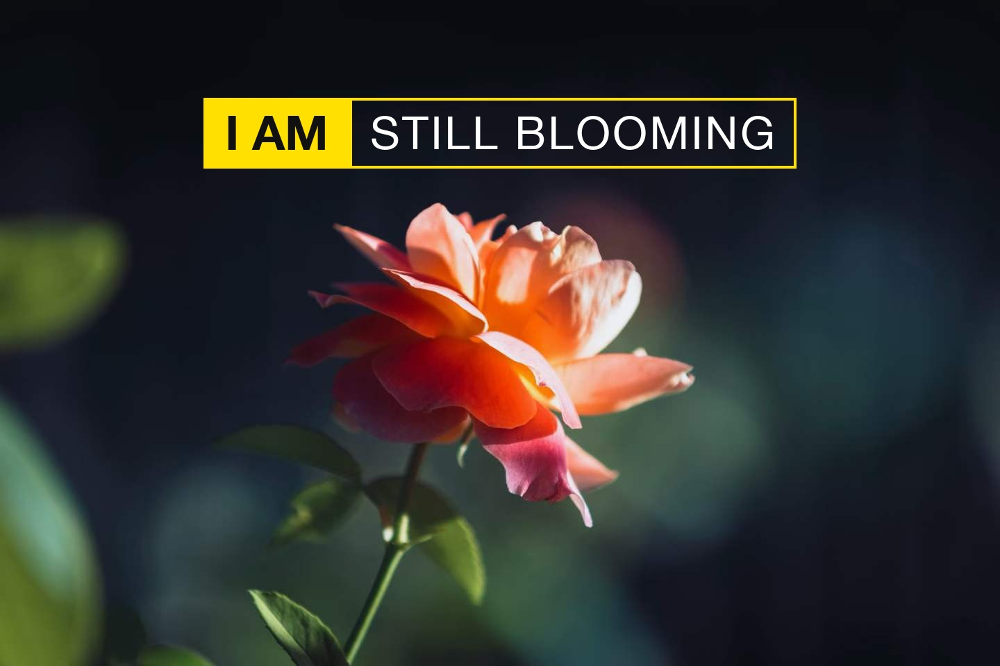
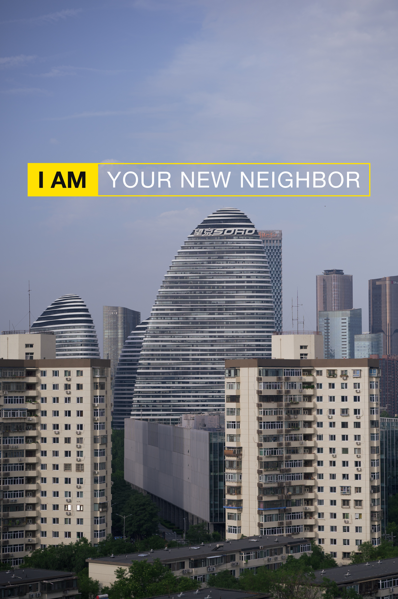
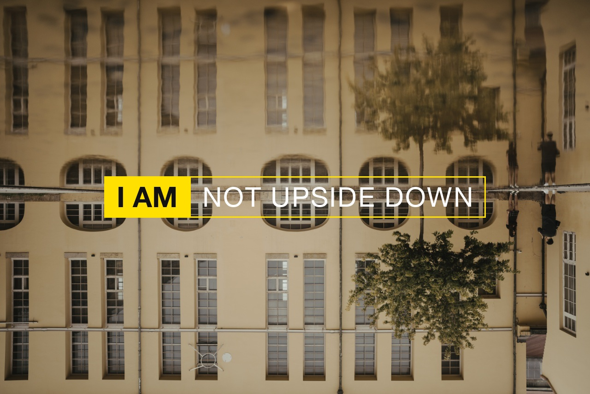
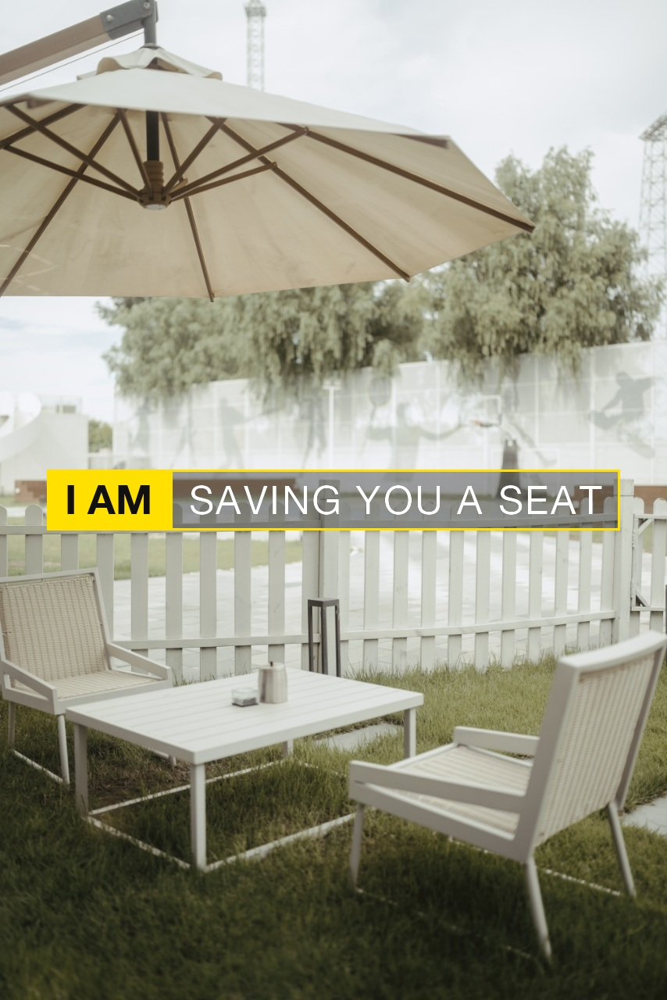

<div align="center">

# I AM CAPTION

### 黄字宣言 · 一句 I AM，说出画外的事

把一张照片，变成一句第一人称的宣言。灵感来自尼康经典广告《I AM NIKON》——照片保持原样，只压上一句黄字，说出照片没拍到的故事。

[English](README.en.md) · [作品档案](https://github.com/AaronyfDesign/i-am-caption/issues?q=label%3Ashowcase) · [LICENSE](LICENSE)

</div>

---

## How to Use

把 Skill 目录复制到你的 Agent Skills 目录：

```bash
git clone https://github.com/AaronyfDesign/i-am-caption.git
cp -R i-am-caption ~/.catpaw/skills/   # 或 ~/.codex/skills
```

然后上传一张照片，说一句：

> 给这张照片加一句 I AM 宣言

视角、文案、位置全部自动完成。输出为成品图 + 一句创作说明，同时附带一个 HTML 编辑器（可在浏览器里改文字、调位置、导出全尺寸 PNG）。

也可以直接用排版脚本：

```bash
python3 scripts/render_i_am_caption.py photo.jpg -t "STILL BLOOMING" -o result.jpg --html editor.html
```

## Showcase

| I AM STILL BLOOMING | I AM YOUR NEW NEIGHBOR |
| :---: | :---: |
|  |  |
| **I AM NOT UPSIDE DOWN** | **I AM SAVING YOU A SEAT** |
|  |  |

更多案例与完整档案（原图 → 观察 → 成品）见 [Showcase 议题区](https://github.com/AaronyfDesign/i-am-caption/issues?q=label%3Ashowcase)——也欢迎你用 [showcase 模板](https://github.com/AaronyfDesign/i-am-caption/issues/new?template=showcase.yml)晒出你自己的作品。

---

<div align="center">

**每一张照片，都有一句它没说出口的话。**

仅限个人、非商业使用，详见 [LICENSE](LICENSE)。 · I AM CAPTION · 2026

</div>
