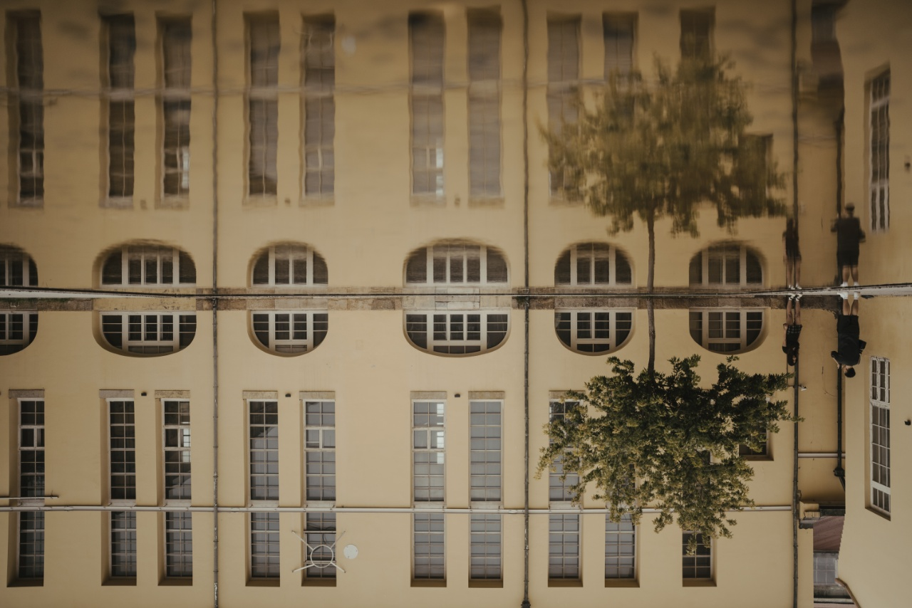

# 03 · 没有颠倒 / Not Upside Down

| 原始照片 | 最终作品 |
| :---: | :---: |
|  |  |

- **Statement**: `I AM NOT UPSIDE DOWN`
- **视角**：泡在水里的黄楼（也可以是整个倒影世界）。
- **方向**：反差幽默 + 画外故事——照片其实是积水里的倒影，上下两个世界只隔一条水线。一本正经的否认，反而让观者开始怀疑到底哪边才是正的。
- **位置**：**几何中心直接成立**——宣言正好骑在水线上，一半泡在倒影里、一半站在真实世界。这是「中心优先」规则最理想的情况。
- **渲染**: `python3 scripts/render_i_am_caption.py source.jpg -t "NOT UPSIDE DOWN" -o result.jpg --html editor.html`
