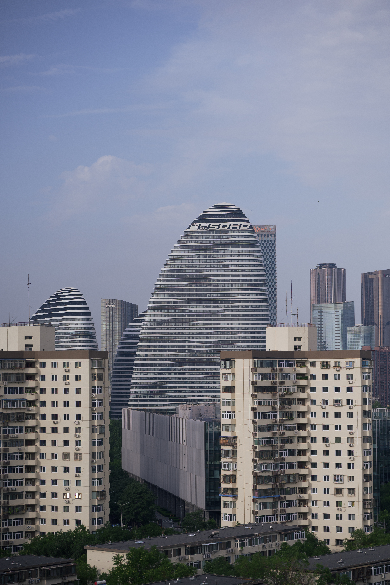
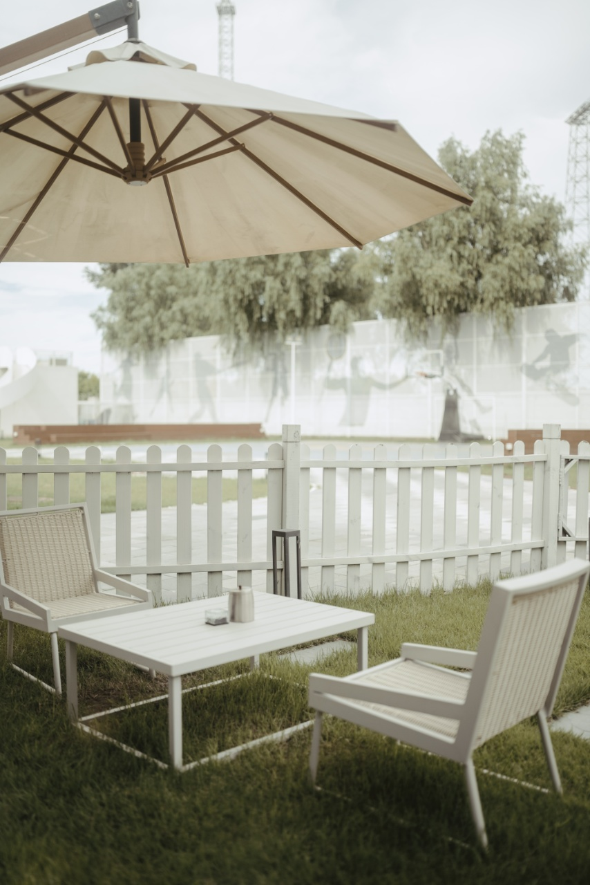

# 作品档案 · Case Archive

这里保存 I AM Caption 的实测案例。每个案例不是单独的一张结果图，而是一份「原始照片 → 观察记录 → 最终作品」的档案：代入的视角、画面的事实、宣言指向的画外故事，以及位置与尺寸的决策过程。

## 01 · 仍在开放 / Still Blooming

| 原始照片 | 最终作品 |
| :---: | :---: |
|  |  |

[打开档案](01-still-blooming/)

## 02 · 新邻居 / Your New Neighbor

| 原始照片 | 最终作品 |
| :---: | :---: |
|  |  |

[打开档案](02-your-new-neighbor/)

## 03 · 没有颠倒 / Not Upside Down

| 原始照片 | 最终作品 |
| :---: | :---: |
|  |  |

[打开档案](03-not-upside-down/)

## 04 · 给你留了座位 / Saving You a Seat

| 原始照片 | 最终作品 |
| :---: | :---: |
|  |  |

[打开档案](04-saving-you-a-seat/)
